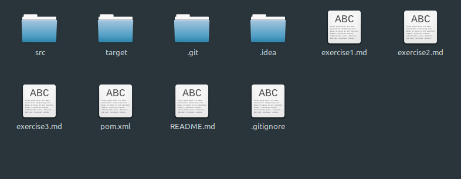
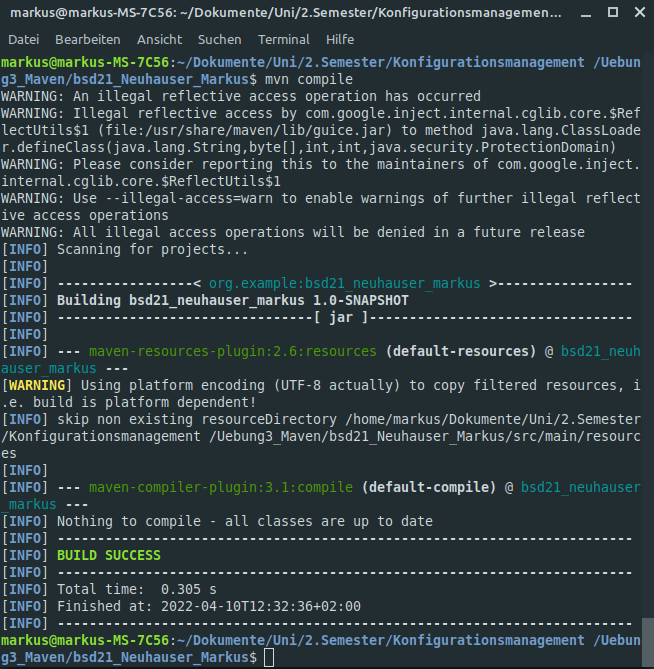
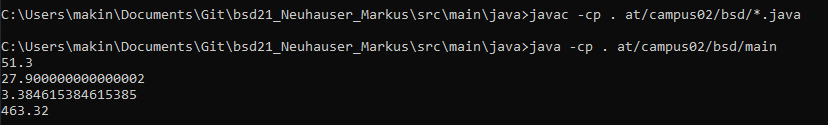

# Exercise 3
In this exercise we will learn, how to combine Java, Intellij and GitHub.

* *First check if you have the correct Java and Maven versions*

### Create the project

* Create a new project with your *IDE*
* With *.gitignore* you can exclude single files and whole filetypes

... Now develop your project ... 

... and start it for the first time ...

* After the first build of your project you can see a new folder called *target*.

    

* The target folder is used to house all output of the build. 

### Build your project with your terminal

* Edit the *pom.xml* file and add your Java and Maven versions, etc.
* Now you can build your file inside the terminal using `mvn compile`.

    

* *Compiling with Linux worked, but I couldn't get it to run, so I switched to Windows for the final step.*

  

