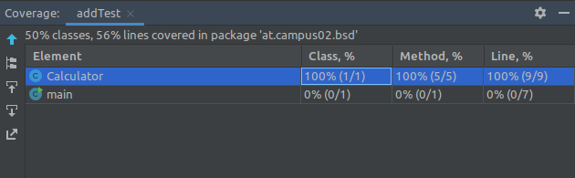
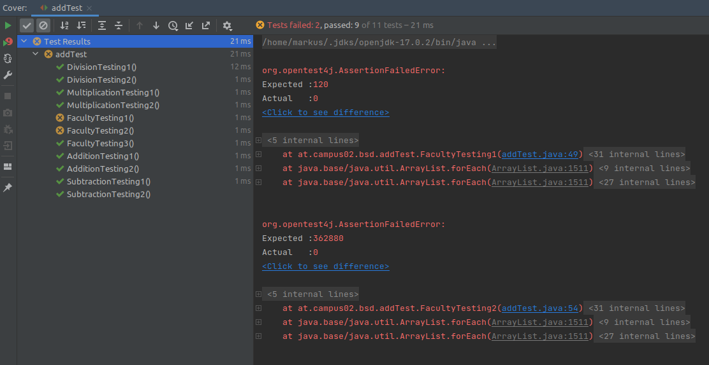
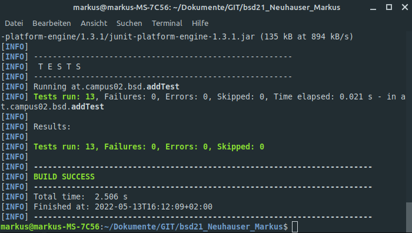

# Exercise 4

## Source Code testing

### Additon, Subtraktion, Multiplikation, Division

* 1.Test: Überprüft das Ergebnis mit einem fertigen Ergebnis
* 2.Test: Überprüft das Ergebnis mittels einer Rechenoperation innerhalb der Testmethode

### Run ... with coverage:

## Faculty

### Phase 1

* Methode wurde erstellt, liefert nun aber immer den Wert 0, da die Berechnung der Fakultät noch nicht eingefügt wurde.
* Der 3. Test wurde trotzdem bestanden, da negative Parameter immer 0 zurückgeben sollen.

### Testaufbau

* 1.Test: Überprüft das Ergebnis mit einem fertigen Ergebnis.
* 2.Test: Überprüft das Ergebnis mittels einer Rechenoperation innerhalb der Testmethode.
* 3.Test: Überprüft das Ergebnis mit einem negativen Parameter.

### Phase 2

* Berechnung für Fakultät einbauen.

### Erweiterung Testaufbau

* 4.Test: Überprüft das Ergebnis mit dem Parameter 1.
* 5.Test: Überprüft das Ergebnis mit dem Parameter 0.

## Tests in der Konsole ausführen

`mvn test`

