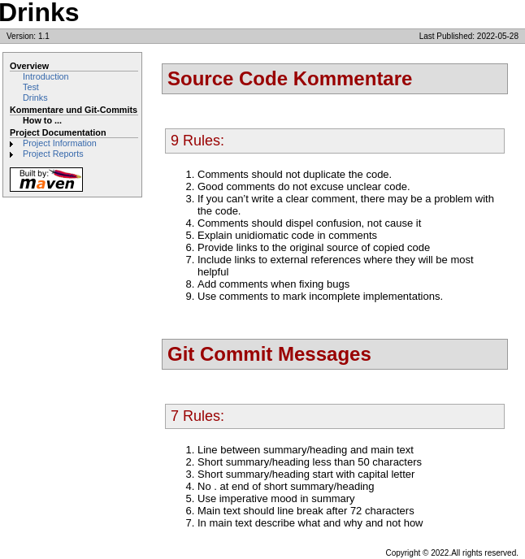
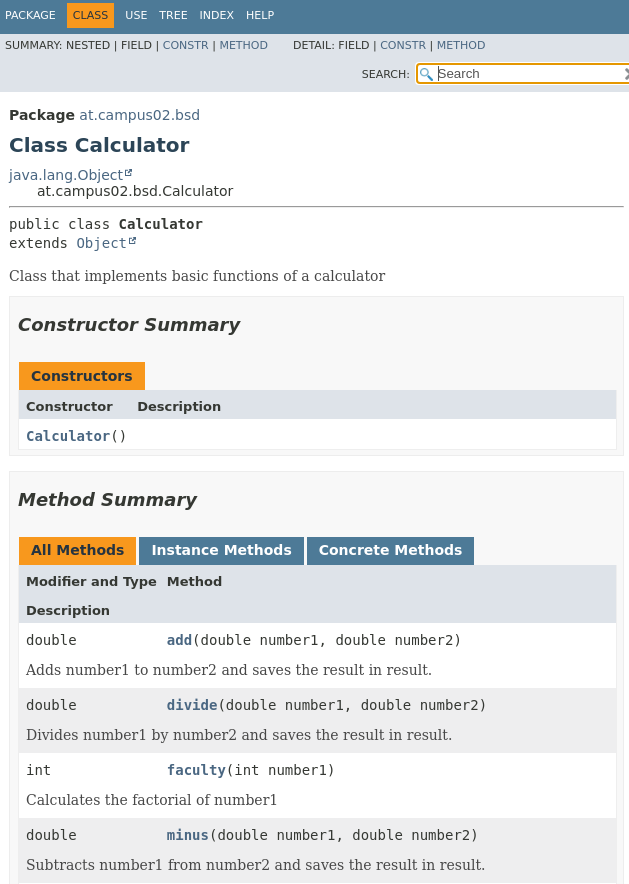
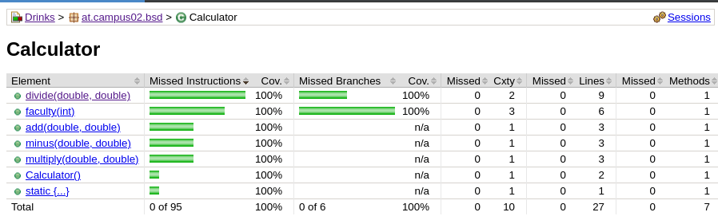

# Exercise 6

## Fragen:

#### Was ist notwendig um Maven Site Dokumentation zu generieren?
1. Richtige Ordnerstruktur
2. `site.xml`
3. `pom.xml` muss alle notwendigen dependencies enthalten. 

#### Welche unterschiedlichen Aspekte, Konfigurationen, Informationen, usw. werden in site.xml bzw. pom.xml konfiguriert? 

- In der `site.xml` kann eine eigene Menü-Übersicht der einzelnen Dateien erstellt werden. 

## Bilder

#### ex6_1:

#### ex6_2:

#### ex6_3:

